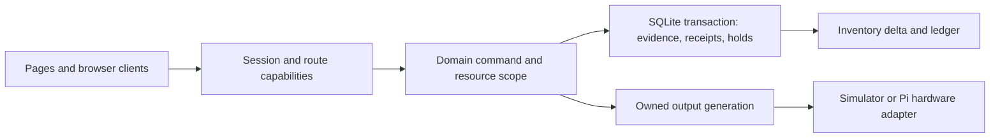

# Software module boundaries

LightGuide remains one local Node process and one SQLite database. Domain commands own permissions, transactions and physical evidence. HTTP pages and browser clients present those commands. Legacy storage helpers remain private compatibility code rather than alternate application commands.

| Boundary | Owner / entry points | Contract |
|---|---|---|
| Identity and access | `modules/access/catalog.js`, `service.js`, `routes-policy.js` | Named roles, capability prerequisites, current-session revalidation, role audit, last full administrator; default-deny routes. |
| Work and movement review | `modules/operations/service.js` | Reservations, assignment generations, physical evidence, durable receipts, actuals, corrections and reconciled duplicates. |
| Work read views | `modules/operations/queries.js` | Scoped SQL filtering, 100-task pages, full-set counts, people filters and bounded review pages. Reads do not advance task activity or deadlines. |
| Stocktaking | `modules/stocktaking/service.js`, `accounting.js` | Original observations and baselines, stale-count recheck, controlled conditions, verified settlements and movement/count links. |
| Inventory posting | `modules/inventory/ledger.js` | Private transaction-only balance delta and ledger insertion used by current work and approved stocktake corrections. Caller owns evidence and idempotency checks. |
| Products and reporting | `services/catalog.js`, `product-fields.js`, `unit-conversions.js`, `reporting.js`, `report-definitions.js` | Capability-authorized mutations, typed values, unit provenance and historical report semantics. Default product creation also retains legacy custom-value entry. |
| Locations and output ownership | `modules/locations/*`, `services/display-coordinator.js` | Location descriptions, QR identity, commissioning and separate output leases; display-only commands cannot change inventory. |
| User maintenance | `modules/maintenance/service.js` | Current capability checks for manual backup, schedule, retention and restore. Scheduled safety backups use the internal backup service. |
| Hardware and firmware host | `modules/hardware/host-adapter.js` | Host discovery, serial setup and firmware command execution; explicit simulator and Linux ARM64 Pi target. |

Legacy `services/inventory.js`, repositories, report readers and hardware transports still contain reusable low-level helpers. They are not a public authorization interface. New user commands must enter an authorized service and must not import a raw stock setter as a shortcut. Unit conversion retains its specialized historical conversion transaction. Broad rewrites of these compatibility helpers are intentionally outside this incremental extraction.

## Firmware bundle contract

The supported installer target is Linux ARM64 Raspberry Pi. Existing explicitly installed Arduino tools remain a compatibility path. `FIRMWARE_TOOLCHAIN_ROOT` selects a prepared, host-specific offline bundle. It contains `bin/arduino-cli`, installed `data/packages` and `user/libraries`, indexes required by the CLI, and `toolchain.json`. Release preparation uses `scripts/prepare-firmware-bundle.mjs`; it downloads nothing and touches no controller.

The manifest pins CLI 1.3.1, ESP32 core 3.0.7, Adafruit NeoPixel 1.12.3, host architecture, controller protocol and SHA-256 hashes. The CLI executable, core and library must be present before packaging. Runtime checks the host, protocol, file confinement, integrity and actual CLI version. Arduino's mutable `data/inventory.yaml` is not executable toolchain content and is excluded from hashes; build cache lives outside the bundle in the host temporary directory. Installed files must be protected by the installer; verification is cached per host-adapter instance.

Compile and upload are the only firmware job operations. Jobs do not install cores/libraries or update indexes and cannot select dependency-fetching profiles. Compilation preserves `-MMD -c` while passing the controller name, address and module count. Timeouts terminate the subprocess group, escalate to kill if needed, and report failure only when the process closes. A simulated job explicitly says no compilation or device upload occurred and does not save a real controller configuration.

Discovery/identity checks, occupied outputs, active work, controller replacement, current flash permission and the firmware maintenance lock remain in the firmware/domain service. The host adapter cannot decide those business permissions. Physical disconnects, re-detection and failure must never be interpreted as a successful flash.

Offline compilation has been exercised on a macOS ARM64 development host targeting ESP32 at both 1 and 64 modules, with network access blocked. This demonstrates the offline strategy, not Pi installation or physical hardware certification. The Linux ARM64 bundle, Pi serial permissions, USB adapter, RS485 bus, ESP32 flashing and recovery require testing on that hardware before release.

Arduino's supported directory/environment configuration is documented in the [official CLI configuration reference](https://docs.arduino.cc/arduino-cli/configuration/).
